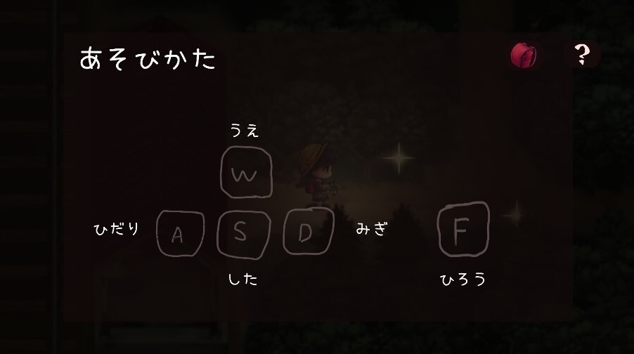

# P2HACKS2022 アピールシート 
### **プロダクトの種類**  
ゲーム

### **タイトル**  
かえりみち

### **あらすじ**  
学校のかえりみち。いつもの電車で少女は目を覚ます。電車を降りると、少女の目には異様な光景が。 

ぼろぼろの駅、こわれた建物、姿を消したねこ。  

なにかがちがういつものかえりみちで少女の冒険がはじまる。

### **コンセプト**  
ユーザーがノスタルジックな世界観を堪能できるゲーム

### **概要**  
【ジャンル】アイテム集めアドベンチャー  
【エンディング数】３  

このゲームはフィクションです。
実在の人物、団体、事件とは一切関係ありません。
また、犯罪や殺生を助長する意図はありません。

### **対象ユーザ**  
若者

### **操作方法**  
>wで上  
>sで下  
>aで左  
>dで右  
  
>fで拾う  
>クリックで次に進む  

### **推しポイント**  
ビジュアルや世界観にこだわった。

## 開発体制  

### **役割分担**  
>グループリーダー  
>>坂上翠  
  
>システム班  
>>安井理緒  
>>西村彩希  
>>矢部由唯  
  
>ビジュアル班  
>>坂上翠  
>>畑井梨里衣  

### **開発における工夫した点**  
* 互いの仕事内容や進捗を定期的に確認、共有するために極力対面で作業を行った。
* Notionを使ってタスク管理や参考サイト共有などを気軽に行えるようにした。

## 開発技術 

**利用したプログラミング言語**  
C#

**利用したフレームワーク・ライブラリ**  
Unity

**その他開発に使用したツール・サービス**  
* MediBangPaint  
* pintrest  
* AviUtl  
* DaVinci Resolve  
* Notion  
* discord  

## 以下ネタバレ注意！！！
### **登場人物**  
>**富香**  
本作主人公。7さいの少女。  
電車通学をしている。 
やさしい兄のことが大好き。  

### **エンディング**
>**エンド1**
翌日、兄は交通事故で帰らぬ人となってしまう。実は、兄は電車に轢かれそうになっている猫の救出を試みて事故にあったのだ。大好きな兄の死は幼い少女の心に大きな傷を残す。

アイテム未コンプリートで電車に乗ることで取得可能。

>**エンド2**  

猫が身代わりになって死ぬ
アイテムコンプリートで電車に乗り、猫を拾わない選択をすることで取得可能。

>**エンド3**
ハッピーエンド
アイテムコンプリートで電車に乗り、猫を拾う選択をすることで取得可能。
